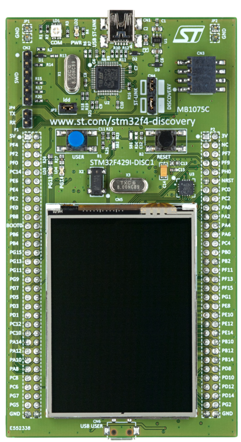
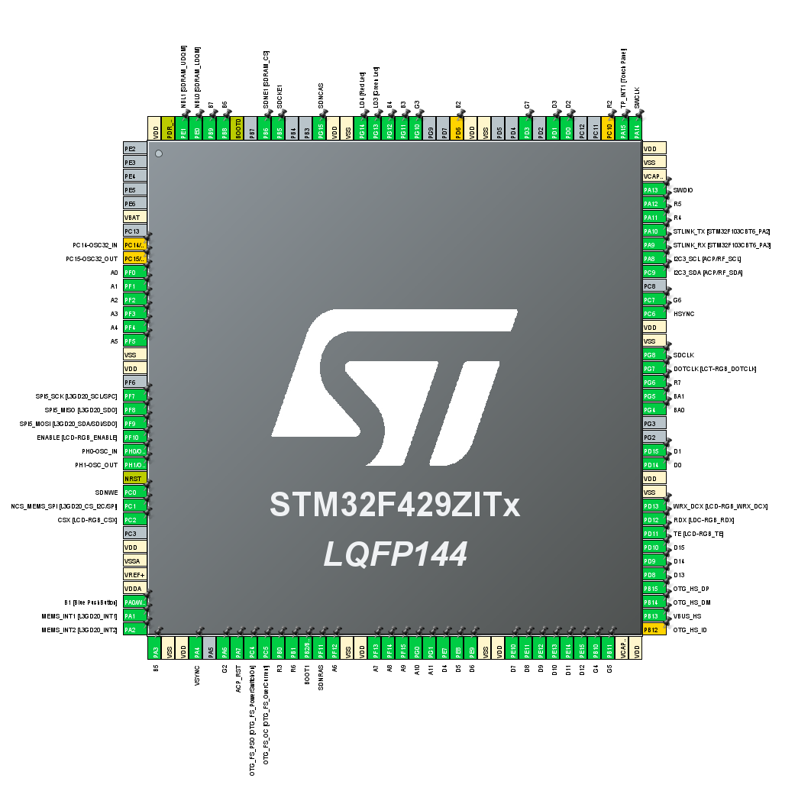
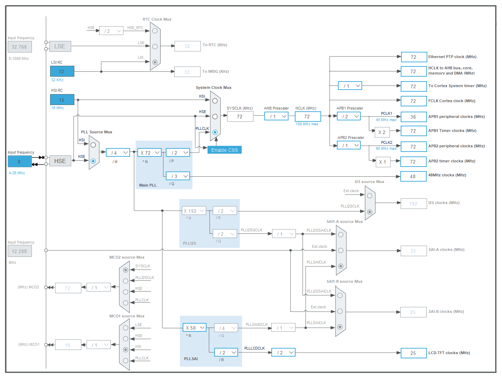
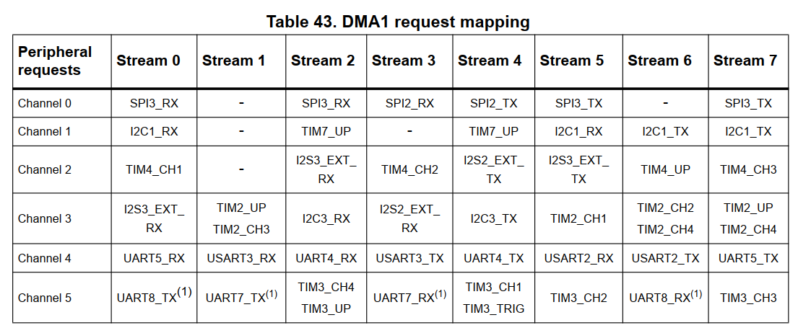
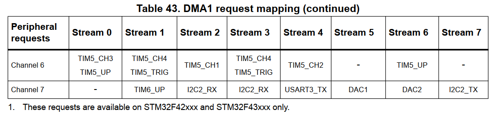
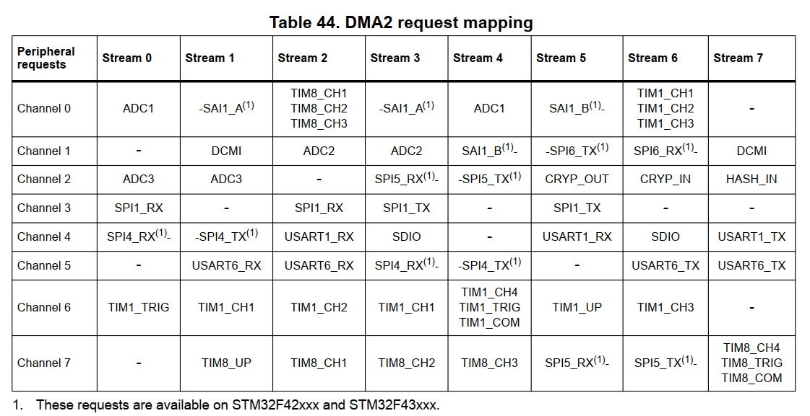

# STM32F429IDISCOVERY Discovery kit的RT-Thread-Studio官方模板应用

## 操作环境

    我的操作环境是：
    * Windows 10 专业版
    * STM32F429IDISCOVERY Discovery kit B01 开发板
    * Zephyr 版本: $4.3.0







## 初始内存使用记录(FLASH: 18276 B, RAM: 4608 B)
```
 59427@HeroZhou  E:  zephyrproject   zephyrproject 3.12.10  ERROR  west build -p always -b stm32f429i_disc1 zephyr\samples\basic\blinky
-- west build: making build dir E:\zephyrproject\build pristine
-- west build: generating a build system
Loading Zephyr default modules (Zephyr base).
-- Application: E:/zephyrproject/zephyr/samples/basic/blinky
-- CMake version: 3.28.1
-- Found Python3: E:/zephyrproject/.venv/Scripts/python.exe (found suitable version "3.12.10", minimum required is "3.10") found components: Interpreter
-- Cache files will be written to: E:/zephyrproject/zephyr/.cache
-- Zephyr version: 4.3.0 (E:/zephyrproject/zephyr)
-- Found west (found suitable version "1.5.0", minimum required is "0.14.0")
-- Board: stm32f429i_disc1, qualifiers: stm32f429xx
...
-- Zephyr version: 4.3.0 (E:/zephyrproject/zephyr), build: v4.3.0
[149/149] Linking C executable zephyr\zephyr.elf
Memory region         Used Size  Region Size  %age Used
           FLASH:       18276 B         2 MB      0.87%
             RAM:        4608 B       192 KB      2.34%
           SRAM0:          0 GB       192 KB      0.00%
             CCM:          0 GB        64 KB      0.00%
          SDRAM2:          0 GB         8 MB      0.00%
        IDT_LIST:          0 GB        32 KB      0.00%
Generating files from E:/zephyrproject/build/zephyr/zephyr.elf for board: stm32f429i_disc1
```

## 代理设置方法
```
$env:http_proxy="http://127.0.0.1:10808"
$env:https_proxy="http://127.0.0.1:10808"
```
## 工程文件查找技巧

### 命令输出筛选功能
```
west boards | Select-String -Pattern "f429i"
```

### 查找当前目录及其所有子目录中，文件名包含 'ap3216c' 的所有文件
```
Get-ChildItem -Recurse -Filter '*ap3216c*' -ErrorAction SilentlyContinue
```

### 查找 dts/bindings/sensor 目录下所有 *.yaml 文件内容中包含 'ap3216c' 的文件
```
Get-ChildItem -Path .\dts\bindings\sensor -Recurse -Include *.yaml | Select-String -Pattern "ap3216c" -AllMatches
```
- 命令详解：Get-ChildItem -Path .\dts\bindings\sensor -Recurse -Include *.yaml:
    - 首先，找到 dts\bindings\sensor 目录下所有的 YAML 文件。
    - '|': 将上一个命令的输出（文件对象）作为输入，传递给下一个命令。
    - Select-String -Pattern "ap3216c" -AllMatches:
        - 在传入的文件对象的内容中搜索 "ap3216c" 字符串。
        - 输出结果会显示文件名和匹配的行号。

### 查搜索子目录内的所有文件内容，查找含有'DMA'文件
```
Get-ChildItem -Path . -Recurse -Filter *.* | Select-String -Pattern "DMA"
Get-ChildItem -Path . -Recurse -Include *.overlay,*.dts | Select-String -Pattern "st7789"
```
- 命令解释：
    - Get-ChildItem -Path . -Recurse: 递归地获取当前目录 (.) 及其所有子目录下的所有文件和文件夹。
    - -Filter *.*: 确保只处理文件（如果只搜索特定类型文件，例如 .c 和 .dts，可以改为 -Include *.c,*.dts,*.conf）。
    - |: 管道操作符，将前一个命令的输出传递给后一个命令。
    - Select-String -Pattern "DMA": 在接收到的所有文件的内容中搜索包含字符串 "DMA" 的行。

## west常用命令

### 编译指定开发板

```
west build -p always -b stm32f429i_disc1 zephyr\samples\basic\blinky
west build -p always -b stm32f429i_disc1 .\F429
west build -p auto -b stm32f429i_disc1 .\F429
west build -b stm32f429i_disc1 -t menuconfig .\F429
west build -b stm32f429i_disc1 -t guiconfig .\F429
west build -t clean
```

### 清理构建（Build）目录

```
west build -t clean
west build -t traceconfig
```

## overlay设置

### PWM功能
```
#include <dt-bindings/pinctrl/stm32-pinctrl.h>
#include <dt-bindings/pwm/pwm.h>
```

## Zephyr Shell 提供的内置命令

### 开启线程统计功能 (Kconfig)

- 在 prj.conf 中，你需要确保开启了以下宏，否则 Shell 里看不到线程相关的详细统计：
```
# 开启内核对象查询（必须）
CONFIG_THREAD_MONITOR=y
# 开启线程名显示（方便识别是哪个任务）
CONFIG_THREAD_NAME=y
# 开启栈分析功能（查看具体使用了百分之几）
CONFIG_THREAD_STACK_INFO=y
CONFIG_THREAD_ANALYZER=y
```

- 使用 Shell 命令查看
```
kernel threads
kernel thread analyzer
```

## STM32F429I-DISC1 开发板功能配置

### 操作系统的“默认角色”

```
	chosen {
		zephyr,console = &usart1;
		zephyr,shell-uart = &usart1;
		zephyr,sram = &sram0;
		zephyr,flash = &flash0;
		zephyr,ccm = &ccm0;
		zephyr,display = &ltdc;
		zephyr,touch = &stmpe811;
	};
```

### USART1引脚配置

- TX    PA9
- RX    PA10

### DMA request mapping







### led引脚配置

- User LD3  PG13    green   高电平点亮
- User LD4  PG13    red     高电平点亮

```
	leds {
		compatible = "gpio-leds";

		green_led_3: led_3 {
			gpios = <&gpiog 13 GPIO_ACTIVE_HIGH>;
			label = "User LD3";
		};

		red_led_4: led_4 {
			gpios = <&gpiog 14 GPIO_ACTIVE_HIGH>;
			label = "User LD4";
		};
	};
```

### 按钮引脚配置

- User button  PA0    green   默认下拉，硬件100nF防抖

```
	gpio_keys {
		compatible = "gpio-keys";

		user_button: button {
			label = "User";
			gpios = <&gpioa 0 GPIO_ACTIVE_LOW>;
			zephyr,code = <INPUT_KEY_0>;
		};
	};
```

### 自带屏幕配置

#### 配置与控制信号 (Control Signals / SPI 模式)

在 Zephyr 初始化阶段，这些引脚通过 **SPI5** 协议发送指令。**若此部分配置错误，屏幕将保持初始化的白屏状态**。

* **CSX (Chip Select)**：对应 **PC2**。**片选信号**，低电平有效。用于选中 ILI9341 进行 SPI 通讯。
* **WRX / DCX (Data/Command Selection)**：对应 **PD13**。**数据/命令选择切换**。
* **低电平**：写入的是指令/寄存器地址。
* **高电平**：写入的是指令参数或颜色数据。
* **SCL**：对应 **PF7**。**SPI5_SCK 时钟信号**。
* **SDA**：对应 **PF9**。**SPI5_MOSI 数据信号**。
* **RDX (Read)**：对应 **PD12**。**读取信号**，用于从 ILI9341 读取状态信息或显存数据。
* **TE (Tearing Effect)**：对应 **PD11**。**撕裂效应反馈信号**。用于将 MCU 写入显存的速度与屏幕物理刷新速度同步，防止图像撕裂。Zephyr 官方的 ILI9341 驱动绑定文件（Binding）中没有定义 te-gpios 这个属性。
* **NRST (Reset)**：连接至系统 **NRST**。**硬件复位引脚**，拉低可使屏幕控制器重启。

- **CSX (Chip Select)**				PC2
- **DCX (Data/Command Selection)**	PD13
- **SCL / SPI5_SCK**				PF7
- **SDA / SPI5_MOSI**				PF9
- **RDX (Read)**					PD12
- **TE (撕裂效应反馈信号)**			 PD11