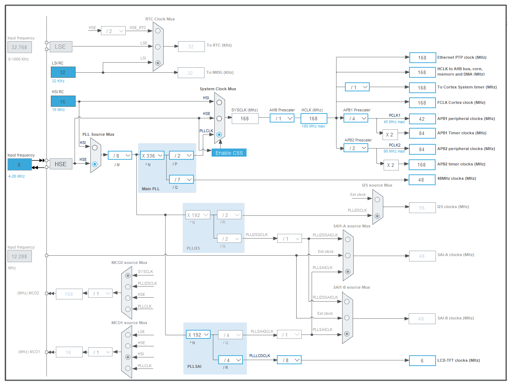

设备树（DTS）配置片段：
```
&clk_lsi {
	status = "okay";
};

&clk_hse {
	clock-frequency = <DT_FREQ_M(8)>;
	status = "okay";
};

&pll {
	div-m = <8>;
	mul-n = <336>;
	div-p = <2>;
	div-q = <7>;
	clocks = <&clk_hse>;
	status = "okay";
};

&pllsai {
	div-m = <8>;
	mul-n = <192>;
	div-r = <4>;
	div-divr = <8>;
	clocks = <&clk_hse>;
	status = "okay";
};

&rcc {
	clocks = <&pll>;
	clock-frequency = <DT_FREQ_M(168)>;
	ahb-prescaler = <1>;
	apb1-prescaler = <4>;
	apb2-prescaler = <2>;
};

&rtc {
	clocks = <&rcc STM32_CLOCK(APB1, 28)>,
		 <&rcc STM32_SRC_LSI RTC_SEL(2)>;
	status = "okay";
};
```

这是 STM32F429 典型的时钟树配置。通过计算这些参数，我们可以还原出当前系统的核心频率和各外设总线频率。

以下是基于你的 **MB1075 B-01** 硬件参数计算出的时钟配置清单：



### **1. 核心主时钟配置 (PLL 系统)**

主时钟源来自 **HSE (外部高速晶振)**，频率为 **8MHz**。

* **输入源**: HSE = 8MHz
* **PLL 计算公式**: `(HSE / div-m) * mul-n / div-p`
* **计算过程**: `(8MHz / 8) * 336 / 2 = 168MHz`
* **结果**: **SYSCLK (系统主频) = 168MHz** 

**注意**：虽然 STM32F429 最高支持 180MHz，但你的配置选择了更稳健的 **168MHz**，这也是很多旧版 Discovery 板的标准配置。

---

### **2. 总线频率配置 (Prescalers)**

基于 `SYSCLK = 168MHz`，各总线频率如下：

* **HCLK (AHB 总线)**: `168MHz / 1 = 168MHz` (供电给 DMA, Flash, GPIO 等)
* **PCLK1 (APB1 低速总线)**: `168MHz / 4 = 42MHz` (最高允许 45MHz)
* *APB1 Timer Clock*: 由于分频系数不为 1，定时器时钟为 `PCLK1 * 2 = 84MHz`。


* **PCLK2 (APB2 高速总线)**: `168MHz / 2 = 84MHz` (最高允许 90MHz)
* *APB2 Timer Clock*: 同样，定时器时钟为 `PCLK2 * 2 = 168MHz`。


---

### **3. 屏幕专用时钟 (PLLSAI - LCD-TFT)**

这是驱动 ILI9341 屏幕最关键的部分。`PLLSAI` 专门用于生成 **LCD_CLK**。

* **输入源**: HSE = 8MHz
* **计算公式**: `((HSE / div-m) * mul-n / div-r) / div-divr`
* **计算过程**:
1. `8MHz / 8 = 1MHz` (VCO 输入)
2. `1MHz * 192 = 192MHz` (VCO 输出)
3. `192MHz / 4 = 48MHz` (PLLSAI_R)
4. `48MHz / 8 = 6MHz` (最终输出给 LTDC)


* **结果**: **LCD_CLK = 6MHz**

**分析**：这个 6MHz 就是你屏幕的像素时钟（Pixel Clock）。对于 240x320 的屏幕，6MHz 的刷新率大约在 **60Hz** 左右，是非常标准且稳定的配置。

---

### **4. USB/SDIO 时钟 (PLL-Q)**

* **计算过程**: `(8MHz / 8) * 336 / 7 = 48MHz`
* **结果**: **PLL48CLK = 48MHz** (正好满足 USB 和 SD 卡控制器对 48MHz 的硬性要求)。

### **5. RTC 时钟**

* **`clocks = <&rcc STM32_CLOCK(APB1, 28)>, <&rcc STM32_SRC_LSI RTC_SEL(2)>;`**
这里定义了 RTC 模块所需的两个时钟源：
1. **接口时钟 (Interface Clock)**: `STM32_CLOCK(APB1, 28)` 指向 APB1 总线的第 28 位。这用于驱动 RTC 的寄存器接口，允许 CPU 通过总线读写 RTC 寄存器。
2. **计数时钟 (Counter Clock)**: `STM32_SRC_LSI RTC_SEL(2)` 指定 **LSI（内部低速振荡器）** 作为 RTC 的实际计时来源。

* **`RTC_SEL(2)`**: 这是一个选择器开关。在 STM32 的 RCC 寄存器中，`2` 通常代表选择 **LSI**。

#### **RTC 时钟频率与精度分析**

* **LSI 频率**: 约为 **32 kHz**（STM32 内部 LSI 通常在 30kHz - 32kHz 之间浮动）。
* **精度说明**:
* **优点**: 无需外部晶振，节省引脚和成本。在低功耗模式（Stop/Standby）下依然可以运行。
* **缺点**: 精度较低，受温度影响较大。如果你需要做高精度的万年历，通常建议改用 **LSE (32.768 kHz 外部晶振)**。

#### **为什么需要这个配置？**

1. **日志时间戳**: 开启 RTC 后，Zephyr 的日志打印（printk）可以使用真实的 wall-clock 时间戳，而不仅仅是启动后的秒数。
2. **低功耗唤醒**: 如果你的项目后续涉及睡眠模式，RTC 可以作为定时唤醒源。
3. **时间同步**: 配合网络或 GPS 模块时，RTC 用于在掉电（有后备电池时）或重启后保持时间。

---

### **6. 为什么串口看不到版本信息？（结合时钟分析）**

从时钟配置来看：

1. **时钟配置正确且标准**，不存在波特率由于时钟算错而乱码的问题。
2. **启动速度**：你的系统运行在 168MHz。
3. **潜在原因**：STM32F429 在启动时需要等待 `PLL` 和 `PLLSAI` 锁定（Lock）。如果你没有开启 `CONFIG_LOG_MODE_IMMEDIATE=y`，Zephyr 可能会在时钟还没完全稳定切换到 168MHz 时就尝试发送 Banner，导致首段字符丢失。

### **总结文档**

| 信号名称 | 频率值 | 说明 |
| --- | --- | --- |
| **HSE** | 8 MHz | 外部晶振输入 |
| **SYSCLK** | **168 MHz** | CPU 核心主频 |
| **HCLK** | 168 MHz | AHB 总线 (高速外设) |
| **PCLK1** | 42 MHz | APB1 总线 (UART2-5, I2C等) |
| **PCLK2** | 84 MHz | APB2 总线 (UART1, SPI等) |
| **LCD_CLK** | **6 MHz** | **LTDC 像素刷新时钟** |
| **USB/OTG** | 48 MHz | 专用 48M 时钟 |
| **RTC** | **~32 kHz** | 采用LSI，用于后台计时与低功耗 |

**建议**：你的 LCD 时钟 (6MHz) 设置得非常稳。如果屏幕依然白屏，**建议检查 SPI5 的时钟**。SPI5 挂在 APB2 上，频率为 84MHz。在设备树中，你的 `mipi-max-frequency = <5625000>` 会对这个 84MHz 进行分频。
