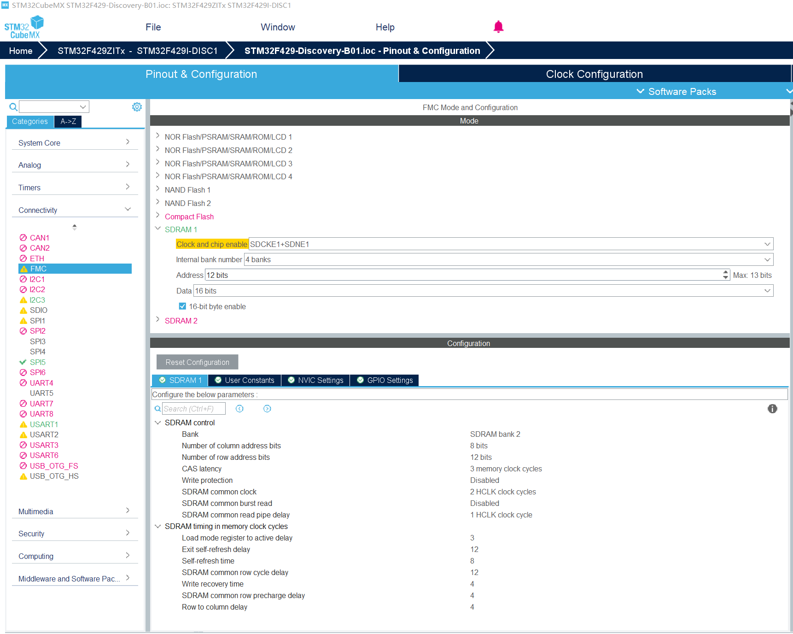

# STM32F429I-DISCO (B-01) FMC配置详述

从CubeMX 来看，这是一套非常标准的 **STM32F429I-DISCO (B01)** 板载 SDRAM 配置。CubeMX 中的图形化设置与 Zephyr 设备树（Devicetree）参数是**一一对应**的。



---

## 以下是将 CubeMX 参数映射到 Zephyr 设备树的详细对照表，以及每个属性的深度解析：

### 一、 CubeMX 与 Devicetree 参数映射表

| CubeMX 配置项 | 对应 Devicetree 属性 | 对应值 (基于你的截图) | 说明 |
| --- | --- | --- | --- |
| **Bank** | `reg = <...>` | `reg = <1>;` | 对应 FMC Bank 2 (SDRAM Bank 2) |
| **Column address bits** | `st,sdram-control` | `STM32_FMC_SDRAM_NC_8` | 8位列地址 |
| **Row address bits** | `st,sdram-control` | `STM32_FMC_SDRAM_NR_12` | 12位行地址 |
| **CAS latency** | `st,sdram-control` | `STM32_FMC_SDRAM_CAS_3` | 3个周期延迟 |
| **SDRAM common clock** | `st,sdram-control` | `STM32_FMC_SDRAM_SDCLK_PERIOD_2` | HCLK / 2 = 84MHz |
| **Read pipe delay** | `st,sdram-control` | `STM32_FMC_SDRAM_RPIPE_1` | 1个 HCLK 延迟 |
| **Load mode register...** | `st,sdram-timing` [0] | `2` (对应 3 周期，需减 1) | TMRD: 加载模式寄存器指令到激活指令的延迟 |
| **Exit self-refresh delay** | `st,sdram-timing` [1] | `7` (对应 12 周期) | TXSR: 退出自刷新延迟 |
| **Self-refresh time** | `st,sdram-timing` [2] | `4` (对应 8 周期) | TRAS: 自刷新时间/行激活最短时间 |
| **Common row cycle delay** | `st,sdram-timing` [3] | `7` (对应 12 周期) | TRC: 行循环延迟 |
| **Write recovery time** | `st,sdram-timing` [4] | `2` (对应 4 周期) | TWR: 写恢复时间 |
| **Common row precharge** | `st,sdram-timing` [5] | `2` (对应 4 周期) | TRP: 行预充电延迟 |
| **Row to column delay** | `st,sdram-timing` [6] | `2` (对应 4 周期) | TRCD: 行地址到列地址延迟 |

---

### 二、 关键配置属性详解

#### 1. `st,sdram-control` (控制器行为)

这是定义 FMC 如何“说话”的协议配置：

* **NC_8 / NR_12**: 定义了内存颗粒的寻址结构。8位列和12位行决定了寻址空间的大小和寻址速度。
* **SDCLK_PERIOD_2**: 你的系统主频是 168MHz，`PERIOD_2` 意味着 SDRAM 运行在 **84MHz**。这是 F429 访问外部内存的理想频率。
* **RPIPE_1**: 这是一个“超前采样”设置。在高频（>50MHz）下，为了抵消线路延迟，控制器会提前一个周期开始读取数据管道。

##### 1.1 为什么是 8 位列和 12 位行？

这完全取决于你板子上焊接的那颗 SDRAM 芯片的**内部存储结构（Internal Architecture）**。

* **硬件依据**：STM32F429I-DISCO (B01) 使用的是 **IS42S16400J**。
* **规格书对应**：打开该芯片的数据手册，你会看到它的组织结构描述为：**1Meg x 16-bit x 4-banks**。
* **地址线拆解**：
* **Row Address (12位)**：A0 - A11。规格书明确指出，在执行“激活（Active）”指令时，通过这 12 根地址线选择行。
* **Column Address (8位)**：A0 - A7。在执行“读/写”指令时，通过这 8 根地址线选择列。

* **计算逻辑**：$2^{12} (行) \times 2^8 (列) \times 4 (Banks) \times 16 (位宽) = 64 \text{ Mbits} = 8 \text{ MB}$。
* **结论**：如果你的设备树填错了（比如填了 NC_9），FMC 控制器就会发出多余的地址脉冲，导致内存寻址错乱，表现为“写入 A 地址，B 地址的数据也变了”。

##### 1.2 `STM32_FMC_SDRAM_NB_4` 对应什么？

这个参数对应的是 **Number of Internal Banks**（内部 Bank 的数量）。

* **对应关系**：在 CubeMX 中，它对应的是 **Internal bank number** 下拉框选择的 **4 banks**。
* **硬件依据**：IS42S16400J 内部被划分为 4 个独立的逻辑 Bank。
* **控制信号**：在硬件上，这由 **BA0 (PG4)** 和 **BA1 (PG5)** 两个引脚控制。
* **作用**：设置这个参数是为了让 FMC 知道如何使用 BA 引脚来切换内部的 4 个存储区域。

---

#### 2. `st,sdram-timing` (时间约束)

这一串数字 `<2 7 4 7 2 2 2>` 是 SDRAM 的“生命线”。

* **注意**：Zephyr 设备树中的值通常比 CubeMX 中的数值**少 1**，因为底层寄存器是从 0 开始计数的（例如 CubeMX 设置 3 周期，寄存器填 2）。
* 这些参数确保了内存内部电容充电、放电和切换地址时，控制器能给出足够的等待时间。

#####  `st,sdram-timing = <2 7 4 7 2 2 2>;` 的计算依据

这是最容易出错的地方。其依据是 **SDRAM 数据手册中的时间参数（以纳秒为单位）** 与 **FMC 控制器的时钟周期（HCLK 周期）** 的换算关系。

**计算公式：** $参数值 (周期数) = \text{ceil}(\frac{\text{数据手册时间 } t (ns)}{\text{HCLK 周期 } (ns)})$

根据 CubeMX 截图，对应关系如下：

| 索引 | 属性含义 | CubeMX 数值 | DTS 填值 (CubeMX-1) | 规格书符号依据 (IS42S16400J) |
| --- | --- | --- | --- | --- |
| **[0]** | **TMRD** (Load Mode Register to Active) | 3 | **2** | $t_{MRD}$: 通常为 2 个时钟周期 |
| **[1]** | **TXSR** (Exit Self-refresh delay) | 12 | **7** | $t_{XSR}$: 约 70ns。在 84MHz 下，70/11.9 = 5.8，取 6-7 |
| **[2]** | **TRAS** (Self-refresh time) | 8 | **4** | $t_{RAS}$: 最小 42ns。42/11.9 = 3.5，取 4 |
| **[3]** | **TRC** (Common row cycle delay) | 12 | **7** | $t_{RC}$: $t_{RAS} + t_{RP}$。约 60-70ns |
| **[4]** | **TWR** (Write recovery time) | 4 | **2** | $t_{WR}$: 至少 2 个周期或 14ns |
| **[5]** | **TRP** (Common row precharge) | 4 | **2** | $t_{RP}$: 15ns。15/11.9 = 1.2，取 2 |
| **[6]** | **TRCD** (Row to column delay) | 4 | **2** | $t_{RCD}$: 15ns。15/11.9 = 1.2，取 2 |

**为什么 DTS 填的值比 CubeMX 小？**
因为 STM32 的 FMC 寄存器手册（参考 RM0090）规定：这些位域写入的值 `0` 代表 `1` 个时钟周期，写入 `1` 代表 `2` 个时钟周期。**CubeMX 显示的是人类易读的“周期数”，而 DTS 通常映射到寄存器的“原始值”**，所以需要减 1。

###### 为什么 TRAS 从 8 变成 4？

在 STM32F429 的参考手册（RM0090）中，`FMC_SDTR` 寄存器的 **TRAS** 位域定义如下：

* **寄存器定义**：这些位定义了自刷新周期（Self-refresh period）的时钟周期数。
* **数值偏移**：对于 TRAS，硬件寄存器写入的值 `x` 实际上代表 `x + 1` 个周期。
* **你的疑问（8 变 4）**：
* **CubeMX 的 8**：这是指 **8 个 HCLK 周期**。
* **Zephyr 驱动的逻辑**：在 Zephyr 的 STM32 FMC 驱动实现中，部分参数会根据时钟分频（`SDCLK_PERIOD`）进行二次换算。
* **核心逻辑**：当你设置 `SDCLK_PERIOD_2`（即 SDCLK = HCLK / 2）时，1 个 SDCLK 周期等于 2 个 HCLK 周期。因此，**8 个 HCLK 周期就等于 4 个 SDCLK 周期**。

**结论**：在 DTS 的 `st,sdram-timing` 数组中，填写的数值通常是以 **SDRAM 控制器时钟（SDCLK）** 为单位的寄存器原始值。

---

###### 参数转换的“依据”在哪里？

你可以通过以下三个层级找到确凿的证据：

 **第一层：STM32 参考手册 (RM0090)**

查看 `SDRAM timing register (FMC_SDTRx)` 章节。手册会明确标注每个参数的范围。例如：

* `TWR`: 0000: 1 cycle, 0001: 2 cycles... (这就是减 1 的来源)。
* `TRAS`: 0000: 1 cycle, 0001: 2 cycles...。

**第二层：Zephyr 源代码 (底层逻辑)**

Zephyr 的驱动程序 `drivers/memc/memc_stm32_sdram.c` 会处理这些设备树属性。它会将你在 `.overlay` 中填写的数字直接写进寄存器，或者根据 `SDCLK_PERIOD` 做一次除法。

* **TRAS 计算**：如果 CubeMX 给你的是以 HCLK 为单位的时间，而硬件寄存器是以 SDCLK 为单位，那么：

$$\text{DTS 值} = (\text{HCLK 周期数} / \text{分频系数}) - 1$$

* 你的例子：$(8 / 2) - 1 = 3$。
* **纠正**：如果你看到的推荐配置是 `4`，那可能是为了更保守的稳定性（即给 5 个周期），或者是该驱动版本对“减 1”的处理逻辑有所不同。

**第三层：数据手册 (IS42S16400J)**

这是终极真理。

* 规格书说 $t_{RAS}$ 最小需要 **42ns**。
* 你的 HCLK 是 168MHz（周期约 5.95ns）。
* $42\text{ns} / 5.95\text{ns} \approx 7.05$ 个 HCLK 周期。
* 取整为 **8 个 HCLK 周期**（这就是 CubeMX 填 8 的原因）。
* 换算成 SDCLK（84MHz，周期 11.9ns）：$42\text{ns} / 11.9\text{ns} = 3.53$ 个周期，取整为 **4 个 SDCLK 周期**。

---

###### 总结：你应该填多少？

为了最稳妥地点亮屏幕，建议严格遵循 CubeMX 的转换逻辑，但要注意单位换算：

| 参数 | CubeMX (HCLK) | 换算为 SDCLK (HCLK/2) | DTS 最终填值 (建议) |
| --- | --- | --- | --- |
| **TRAS** | 8 | 4 | **3 或 4** (填 4 更保险) |
| **TRP** | 4 | 2 | **1 或 2** |
| **TRCD** | 4 | 2 | **1 或 2** |

**一句话避坑指南：**
新手最稳的办法是：**先用 56MHz (`PERIOD_3`) 跑通，时序参数给宽一点（数值大一点）**。等 SDRAM 校验成功了，再回头追求 84MHz (`PERIOD_2`) 的极限性能。

---

#### 3. `refresh-rate` (刷新频率)

* **CubeMX 逻辑**: 通常需要计算。IS42S16400J 要求 64ms 内刷新 4096 行。
* **计算公式**: `64ms / 4096 = 15.625 us`。
* **Zephyr 填法**: `15.625us * 84MHz = 1312`。你之前填写的 `1386` 是非常接近的正确值。

---

### 三、 建议的最终设备树配置

根据你最新的 CubeMX 截图，最完美的 `fmc` 配置如下：

```dts
&fmc {
	status = "okay";
    sdram {
        status = "okay";
        power-up-delay = <100>;
        num-auto-refresh = <8>;      /* 初始化标准流程：8次自动刷新 */
        mode-register = <0x0231>;    /* 设置 Burst=2, CAS=3 (对应下面的CAS_3) */
        refresh-rate = <1386>;       /* 基于 84MHz 计算出的 64ms/4096行刷新率 */

        bank@1 {
            reg = <1>;               /* 物理连接：SDRAM 片选挂在 Bank 2 (SDNE1) */

            st,sdram-control = <STM32_FMC_SDRAM_NC_8
                                STM32_FMC_SDRAM_NR_12
                                STM32_FMC_SDRAM_MWID_16
                                STM32_FMC_SDRAM_NB_4
                                STM32_FMC_SDRAM_CAS_3
                                STM32_FMC_SDRAM_SDCLK_PERIOD_2
                                STM32_FMC_SDRAM_RBURST_DISABLE
                                STM32_FMC_SDRAM_RPIPE_1>;

            /* 对应 CubeMX 参数转换 (单位为 SDCLK 周期) */
            /* [TMRD, TXSR, TRAS, TRC, TWR, TRP, TRCD] */
            /* TRAS 说明：CubeMX 的 8 HCLK 换算为 4 SDCLK，寄存器填 4-1=3 或更稳的 4 */
            st,sdram-timing = <2 7 4 7 2 2 2>;
        };
    };
};
```

---

### `power-up-delay = <100>;` (上电延迟)

* **含义**：指 SDRAM 供电稳定后，在执行任何指令（如 PRECHARGE）之前必须等待的时间。
* **数值来源**：
* **规格书要求**：IS42S16400J 规格书明确规定，在上电且 VDD/VDDQ 达到稳定值后，需要至少 **100μs** 的延迟。
* **CubeMX 对应**：在 CubeMX 的 `SDRAM timing` 中，这一项对应 **Load mode register to active delay** 或类似的初始化等待参数。


* **单位**：在 Zephyr 的 STM32 驱动中，该值通常以 **微秒 (μs)** 为单位。

---

### `num-auto-refresh = <8>;` (自动刷新次数)

* **含义**：在初始化序列中，向 SDRAM 发送“自动刷新 (AUTO REFRESH)”命令的次数。
* **作用**：这些刷新操作会预热存储矩阵，确保后续读写数据的准确性。

* **数值来源**：
* **规格书要求**：JEDEC 标准和 IS42S16400J 手册规定，在初始化期间，必须执行至少 **2 次** 自动刷新命令。
* **行业惯例**：为了确保内存内部的电荷完全稳定，工程实践中通常会设置为 **8 次**。

#### 概念区分

* **Number of auto refresh (初始化自动刷新次数)**：
* **作用**：仅在 SDRAM **刚上电初始化**时执行。它连续发送 N 次刷新命令，目的是让 SDRAM 内部的电路（电容）进入稳定状态。
* **设置值**：规格书要求至少 2 次，官方推荐 8 次。这就是设备树中 `num-auto-refresh = <8>;` 的来源。

* **Self-refresh time (TRAS - 截图圈出的位置)**：
* **作用**：这是**正常工作期间**的时序参数。它定义了从“行激活”到“预充电”命令之间的**最小时间间隔**。
* **数值逻辑**：在你的截图 中，数值为 **8**（单位是 HCLK）。由于你的时钟分频是 2，换算到 SDCLK 就是 **4**，对应设备树 `st,sdram-timing` 数组中的第三项。

#### 为什么在 CubeMX 截图里找不到 "Number of auto refresh"？

这是因为 **STM32CubeMX 的 FMC 界面只列出了硬件寄存器的静态参数**。

* `Number of auto refresh` 属于**软件配置命令**。是**初始化序列（Initialization Sequence）**的一部分，通常在 CubeMX 的代码生成逻辑中体现，而不会直接显示在截图的 `SDRAM timing` 列表里，在 CubeMX 生成的 `stm32f4xx_hal_sdram.c` 初始化函数中，会有类似 `Command.AutoRefreshNumber = 8;` 的代码，但在 GUI 界面上，这个参数有时会被隐藏或放在特定的“初始化（Initialization）”标签页下。
* 而在 **Zephyr 框架** 中，为了简化操作，将这个初始化命令需要的次数直接放进了设备树属性 `num-auto-refresh` 中。

#### 参数对应总结表

为了不搞混，请参考下表进行对应：

| 设备树属性 | CubeMX 截图位置 | 推荐值 |
| --- | --- | --- |
| **`num-auto-refresh`** | **不在你的截图中**（属于初始化代码参数） | **8** |
| **`st,sdram-timing` 的第3项** | **Self-refresh time** | **4** (由截图中的 8 换算而来) |
| **`refresh-rate`** | **不在你的截图中**（由规格书 64ms/4096行换算） | **1386** |

**建议：**
你在设备树里保持 `num-auto-refresh = <8>;` 即可，这是确保板载 IS42S16400J 稳定启动的“黄金标准”。你截图中圈出的 **Self-refresh time** 依然按照之前的逻辑填入 `st,sdram-timing` 数组即可。

---

### `mode-register = <0x0231>;` (模式寄存器设置)

这是最核心的参数，它决定了 SDRAM 如何响应 CPU 的读写请求。这个 **16进制数** 是根据 SDRAM 的 **Mode Register (MR)** 位图拼接而成的。

#### **数值拆解 (0x0231)：**

我们将 `0231` 展开为二进制（13位地址线 A0-A12）：
`0 0010 0011 0001`

| 位 (Bit) | 名称 | 设置值 | 含义 |
| --- | --- | --- | --- |
| **A12-A7** | Reserved | `000000` | 预留，必须为 0 |
| **A6-A4** | **CAS Latency** | `011` (3) | **列选通延迟 = 3**。这必须与设备树中的 `STM32_FMC_SDRAM_CAS_3` 严格保持一致。 |
| **A3** | Test Mode | `0` | **标准模式**。`1` 为测试模式，正常使用必须设为 0。 |
| **A2-A0** | **Burst Length** | `001` (2) | **突发长度 = 2**。这意味着 CPU 发起一次读指令，SDRAM 会连续吐出 2 个 16-bit 数据。 |

* **为什么选 0x231？**
* **CAS=3**：是 F429 在 84MHz 下最稳定的选择。
* **Burst=2**：与 STM32 的 FMC 预取（Read Pipe）机制配合良好，有助于提高 LTDC 刷新屏幕时的带宽。

---

### **总结：如何根据 CubeMX 截图修改？**

在你的截图 中：

1. **CAS Latency** 选的是 **3 memory clock cycles**。
2. **SDRAM common clock** 是 **2 HCLK clock cycles** (即 84MHz)。

因此，你的 `mode-register` 必须包含 `CAS=3` 的配置。如果你想尝试更高的性能（比如突发长度 4），可以将其改为 `0x0232`。但对于新手，**`0x0231` 是最稳妥的起步配置**。

**你会发现 `mode-register` 里并没有直接设置 TRAS 等时间，因为那些是写在 FMC 控制器寄存器里的，而这个 `mode-register` 信号是通过地址线直接发给 SDRAM 芯片内部存储的。**


